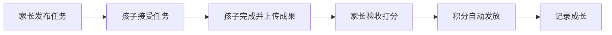
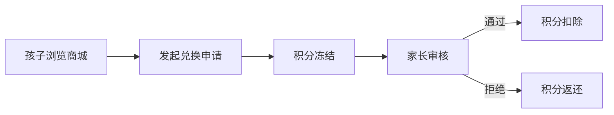
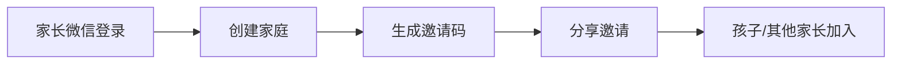

# 童劳童得 - 产品需求文档（PRD）

## 1. 产品概述

**童劳童得**是一款面向家庭的儿童成长激励小程序，以积分体系为核心，集任务管理、成果记录、成长可视化、多元兑换于一体。旨在通过"完成任务 → 获得积分 → 兑换奖励"的闭环，帮助家长系统化培养孩子的责任感和自理能力，同时为家庭留下一份数字化的成长纪念册。

- **产品形态**：微信小程序
- **核心用户**：6-12 岁儿童的家长（尤其是多孩家庭）
- **间接用户**：6-12 岁儿童

---

## 2. 核心功能

### 2.1 用户角色

| 角色 | 描述 |
|------|------|
| **家长（管理员）** | 家庭创建者，拥有完整管理权限：发布任务、验收打分、配置积分规则、审核兑换申请 |
| **孩子（普通成员）** | 接收任务、完成任务并上传成果、查看自己的积分和成长记录、发起兑换申请 |
| **家长（协管员）** | 多家长场景下，第二位家长可协助管理任务、验收等 |

### 2.2 功能模块

#### 2.2.1 家庭管理模块
| 功能名称 | 功能描述 | 优先级 |
|----------|----------|--------|
| 创建家庭 | 家长注册后创建家庭，设置家庭名称、头像 | P0 |
| 加入家庭 | 通过邀请码/链接让孩子或其他家长加入家庭 | P0 |
| 家庭成员管理 | 查看成员列表，编辑成员昵称、头像，移除成员 | P0 |
| 角色设置 | 设置家庭成员角色（家长/孩子），支持多家长 | P1 |
| 多孩切换 | 在家庭内切换查看不同孩子的数据 | P0 |

#### 2.2.2 任务管理模块
| 功能名称 | 功能描述 | 优先级 |
|----------|----------|--------|
| 发布任务 | 家长发布家务/学习任务，设置任务名称、积分值、截止时间、指派给指定孩子 | P0 |
| 任务模板 | 预设常见任务模板（整理房间、洗碗、阅读等），一键发布 | P1 |
| 任务列表 | 按状态（待完成/已完成/已过期）展示任务，支持筛选 | P0 |
| 接受/领取任务 | 孩子查看并领取分配给自己的任务 | P0 |
| 完成任务 | 孩子完成任务后，可拍照上传成果并提交验收 | P0 |
| 验收打分 | 家长查看提交成果，验收通过/不通过，可调整积分（奖励/扣减） | P0 |
| 任务提醒 | 任务即将到期时推送提醒给孩子和家长 | P1 |
| 重复任务 | 支持设置每日/每周重复任务（如每天整理书包） | P2 |

#### 2.2.3 积分体系模块
| 功能名称 | 功能描述 | 优先级 |
|----------|----------|--------|
| 积分规则配置 | 家长自定义积分规则：基础积分、优质完成奖励分、连续打卡加成 | P0 |
| 积分获取 | 完成任务验收通过后自动发放积分 | P0 |
| 积分扣减 | 家长可手动扣减积分（任务未达标、行为惩罚等） | P1 |
| 积分明细 | 展示积分变动记录，包含来源、时间、余额 | P0 |
| 积分曲线 | 以图表展示孩子积分变化趋势（周/月/学期） | P1 |
| 积分排行 | 家庭内多孩积分排行（可选是否显示，避免攀比） | P2 |
| 特殊积分 | 考试进步、比赛获奖等特殊成就自动发放积分 | P1 |

#### 2.2.4 兑换商城模块
| 功能名称 | 功能描述 | 优先级 |
|----------|----------|--------|
| 兑换商品管理 | 家长创建可兑换商品，设置名称、所需积分、库存、图片 | P0 |
| 商品分类 | 支持分类：物质奖励（文具、玩具）、体验奖励（游戏时间、出游）、特权奖励（晚睡、选餐厅） | P1 |
| 兑换申请 | 孩子浏览商城，消耗积分发起兑换申请 | P0 |
| 兑换审核 | 家长审核孩子的兑换申请，通过/拒绝（附理由） | P0 |
| 兑换记录 | 查看历史兑换记录，按家庭成员筛选 | P1 |
| 限量兑换 | 支持设置商品库存和每人限兑次数 | P2 |

#### 2.2.5 成长记录模块
| 功能名称 | 功能描述 | 优先级 |
|----------|----------|--------|
| 成果相册 | 自动汇集任务提交的成果照片，按时间轴展示 | P1 |
| 成长时间线 | 以时间线形式展示孩子的关键成长节点 | P1 |
| 成长报告 | 生成周/月度成长报告，含积分统计、完成任务数等 | P2 |
| 家庭回忆墙 | 家庭活动兑换记录照片墙，记录共同回忆 | P2 |
| 成就徽章 | 达成特定里程碑时自动发放徽章 | P2 |

#### 2.2.6 消息通知模块
| 功能名称 | 功能描述 | 优先级 |
|----------|----------|--------|
| 任务通知 | 新任务分配、任务即将到期、验收结果通知 | P0 |
| 积分变动通知 | 积分到账、积分扣减通知 | P1 |
| 兑换通知 | 兑换申请提交、审核结果通知 | P1 |
| 成就通知 | 达成里程碑时的祝贺推送 | P2 |
| 消息中心 | 站内消息列表，支持已读/未读 | P1 |

#### 2.2.7 用户中心模块
| 功能名称 | 功能描述 | 优先级 |
|----------|----------|--------|
| 注册/登录 | 微信授权一键登录 | P0 |
| 个人资料 | 编辑昵称、头像、性别 | P0 |
| 我的家庭 | 显示当前家庭信息，支持切换/退出家庭 | P0 |
| 我的积分 | 查看当前积分余额和明细 | P0 |
| 我的任务 | 查看我的任务列表（孩子视角）/ 我发布的任务（家长视角） | P0 |

---

## 3. 核心流程

### 3.1 任务闭环流程

### 3.2 积分兑换流程

### 3.3 家庭创建流程

---

## 4. 用户界面设计

### 4.1 设计风格

#### 4.1.1 视觉风格定位
- **整体调性**：温暖、童趣、积极向上，传递"成长快乐"的理念
- **设计关键词**：自然、活力、成就感、家庭温暖
- **适用场景**：任务管理、积分激励、成果展示、商城兑换

#### 4.1.2 色彩方案
| 用途 | 颜色名称 | 色值 | 说明 |
|------|----------|------|------|
| 主色调 | 阳光橙 | #FF9500 | 代表活力、温暖、积极 |
| 辅助色 | 成长绿 | #34C759 | 代表进步、成就、自然 |
| 强调色 | 天空蓝 | #007AFF | 代表信任、沟通、互动 |
| 安全色 | 薰衣草紫 | #AF52DE | 用于成就徽章、特殊奖励 |
| 警示色 | 珊瑚红 | #FF3B30 | 用于过期提醒、扣减积分 |
| 背景色 | 暖白色 | #FFF8F0 | 温馨的家庭氛围 |
| 文字色 | 深灰色 | #1C1C1E | 保证可读性 |

#### 4.1.3 字体规范
- **标题字体**：圆润可爱的中文字体（如思源黑体 Rounded）
- **正文字体**：清晰易读的中文字体（如思源黑体 Regular）
- **数字字体**：使用等宽数字便于积分显示
- **字号层级**：
  - 一级标题：20px/24px
  - 二级标题：18px
  - 正文：16px
  - 辅助文字：14px
  - 标签/提示：12px

#### 4.1.4 按钮与卡片风格
- **按钮圆角**：12px-16px，营造友好感
- **卡片圆角**：16px-20px
- **阴影**：柔和投影，增加层次感
- **间距**：基于4px/8px网格系统

#### 4.1.5 图标与插画风格
- **图标风格**：线性图标 + 填充图标结合，圆角处理
- **插画风格**：简约扁平插画，色彩明快，传递正能量
- **表情包**：使用可爱、积极的emoji风格

### 4.2 页面设计总览

| 页面名称 | 核心模块 | 界面特点 |
|----------|----------|----------|
| 首页（家长视角） | 家庭信息概览、快捷任务入口、积分统计、待办事项 | 信息聚合、突出重点 |
| 首页（孩子视角） | 今日任务、积分余额、成长进度、排行榜入口 | 趣味性强、成就感设计 |
| 任务列表页 | 任务分类Tab、任务卡片列表、筛选/搜索 | 清晰高效、一目了然 |
| 任务发布页 | 任务表单、模板选择、指派孩子 | 简单几步完成发布 |
| 任务详情页 | 任务描述、成果图片、验收按钮、积分信息 | 重点突出、操作便捷 |
| 积分商城页 | 商品分类Tab、商品卡片网格、兑换按钮 | 商品丰富、展示直观 |
| 积分详情页 | 积分曲线图、积分明细列表 | 数据可视化、变化趋势 |
| 成长记录页 | 成果相册、成长时间线、徽章墙 | 时间维度、记忆呈现 |
| 消息中心页 | 消息分类、消息列表 | 高效处理、快速查看 |
| 个人中心页 | 家庭信息、成员管理、设置 | 功能入口清晰 |

### 4.3 响应式设计
- **平台**：微信小程序，兼容 iOS 和 Android
- **适配原则**：根据不同屏幕尺寸自适应布局
- **触控优化**：孩子端需大字体、大按钮，方便操作

---

## 5. 版本规划

| 版本 | 核心功能 | 目标 |
|------|----------|------|
| **V1.0 MVP** | 家庭管理、任务发布与验收、基础积分、兑换商城 | 跑通核心闭环，验证产品价值 |
| **V1.1** | 任务模板、积分曲线、成果相册、消息通知 | 提升使用体验，增强留存 |
| **V1.2** | 重复任务、成长报告、成就徽章、限量兑换 | 丰富激励机制，深化功能 |
| **V2.0** | 家庭回忆墙、多家庭协作、数据分析面板 | 扩展场景，打造平台价值 |
