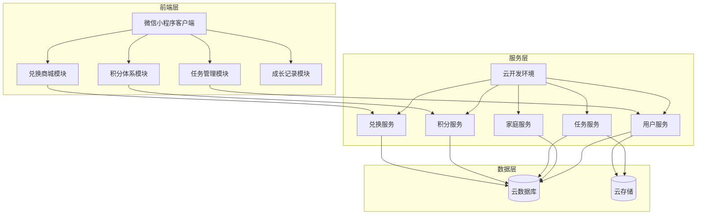
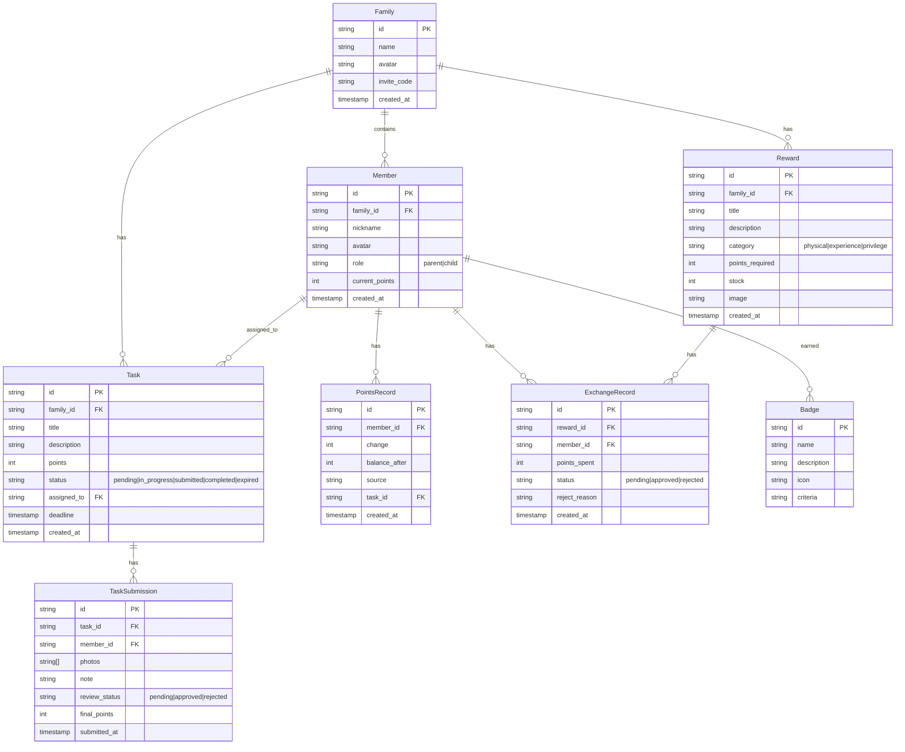

# 童劳童得 - 技术架构文档

## 1. 架构设计



## 2. 技术选型

### 2.1 微信小程序技术栈

| 类别 | 技术方案 |
|------|----------|
| 框架 | 微信小程序原生框架 |
| UI组件 | Vant Weapp / WeUI |
| 状态管理 | MobX-mini |
| 网络请求 | wx.request |
| 图片存储 | 微信云存储 |
| 数据库 | 微信云开发数据库 |

### 2.2 UI设计稿展示技术栈

| 类别 | 技术方案 |
|------|----------|
| 前端框架 | React 18 + TypeScript |
| 构建工具 | Vite |
| CSS框架 | TailwindCSS |
| 状态管理 | Zustand |
| 路由管理 | React Router DOM |
| 图标库 | Lucide React |
| 数据可视化 | Recharts |

## 3. 路由定义（UI设计稿）

| 路由路径 | 页面名称 | 功能描述 |
|----------|----------|----------|
| / | 首页（家长视角） | 家庭信息概览、快捷入口、积分统计 |
| /child | 首页（孩子视角） | 今日任务、积分余额、成长进度 |
| /tasks | 任务列表页 | 任务分类Tab、任务卡片列表 |
| /tasks/create | 发布任务页 | 任务表单、模板选择 |
| /tasks/:id | 任务详情页 | 任务描述、成果上传、验收 |
| /points | 积分详情页 | 积分曲线图、积分明细 |
| /mall | 兑换商城页 | 商品分类Tab、商品列表 |
| /mall/:id | 商品详情页 | 商品信息、兑换操作 |
| /growth | 成长记录页 | 成果相册、成长时间线、徽章 |
| /messages | 消息中心页 | 消息分类、消息列表 |
| /family | 家庭管理页 | 成员列表、邀请管理 |
| /profile | 个人中心页 | 个人信息、家庭切换 |

## 4. 数据模型

### 4.1 数据模型定义



### 4.2 主要数据结构

#### 家庭表 (Family)
| 字段 | 类型 | 说明 |
|------|------|------|
| id | string | 家庭唯一标识 |
| name | string | 家庭名称 |
| avatar | string | 家庭头像URL |
| invite_code | string | 邀请码 |

#### 成员表 (Member)
| 字段 | 类型 | 说明 |
|------|------|------|
| id | string | 成员唯一标识 |
| family_id | string | 所属家庭ID |
| nickname | string | 昵称 |
| avatar | string | 头像URL |
| role | string | 角色：parent/child |
| current_points | number | 当前积分 |

#### 任务表 (Task)
| 字段 | 类型 | 说明 |
|------|------|------|
| id | string | 任务唯一标识 |
| family_id | string | 所属家庭ID |
| title | string | 任务名称 |
| description | string | 任务描述 |
| points | number | 积分奖励 |
| status | string | 状态 |
| assigned_to | string | 指派成员ID |
| deadline | timestamp | 截止时间 |

#### 奖励商品表 (Reward)
| 字段 | 类型 | 说明 |
|------|------|------|
| id | string | 商品唯一标识 |
| family_id | string | 所属家庭ID |
| title | string | 商品名称 |
| category | string | 分类 |
| points_required | number | 所需积分 |
| stock | number | 库存 |

## 5. 核心API接口（微信小程序端）

### 5.1 用户与家庭

| 接口 | 方法 | 说明 |
|------|------|------|
| /family/create | POST | 创建家庭 |
| /family/join | POST | 加入家庭 |
| /family/:id/members | GET | 获取家庭成员 |

### 5.2 任务管理

| 接口 | 方法 | 说明 |
|------|------|------|
| /tasks | GET | 获取任务列表 |
| /tasks | POST | 创建任务 |
| /tasks/:id/submit | POST | 提交任务成果 |
| /tasks/:id/review | POST | 验收任务 |

### 5.3 积分体系

| 接口 | 方法 | 说明 |
|------|------|------|
| /points/:memberId | GET | 获取积分余额 |
| /points/:memberId/records | GET | 获取积分明细 |
| /points/:memberId/curve | GET | 获取积分曲线数据 |

### 5.4 兑换商城

| 接口 | 方法 | 说明 |
|------|------|------|
| /rewards | GET | 获取商品列表 |
| /rewards/:id/exchange | POST | 申请兑换 |
| /exchanges | GET | 获取兑换记录 |

## 6. 项目结构

```
├── src/
│   ├── components/          # 通用组件
│   │   ├── TaskCard/       # 任务卡片
│   │   ├── RewardCard/    # 商品卡片
│   │   ├── PointsDisplay/ # 积分展示
│   │   └── ...
│   ├── pages/             # 页面
│   │   ├── Home/          # 首页
│   │   ├── Tasks/         # 任务相关
│   │   ├── Mall/          # 商城相关
│   │   ├── Growth/        # 成长记录
│   │   └── ...
│   ├── hooks/             # 自定义Hooks
│   ├── stores/            # Zustand状态
│   ├── services/          # API服务
│   ├── types/             # TypeScript类型
│   └── utils/             # 工具函数
├── public/
└── package.json
```
