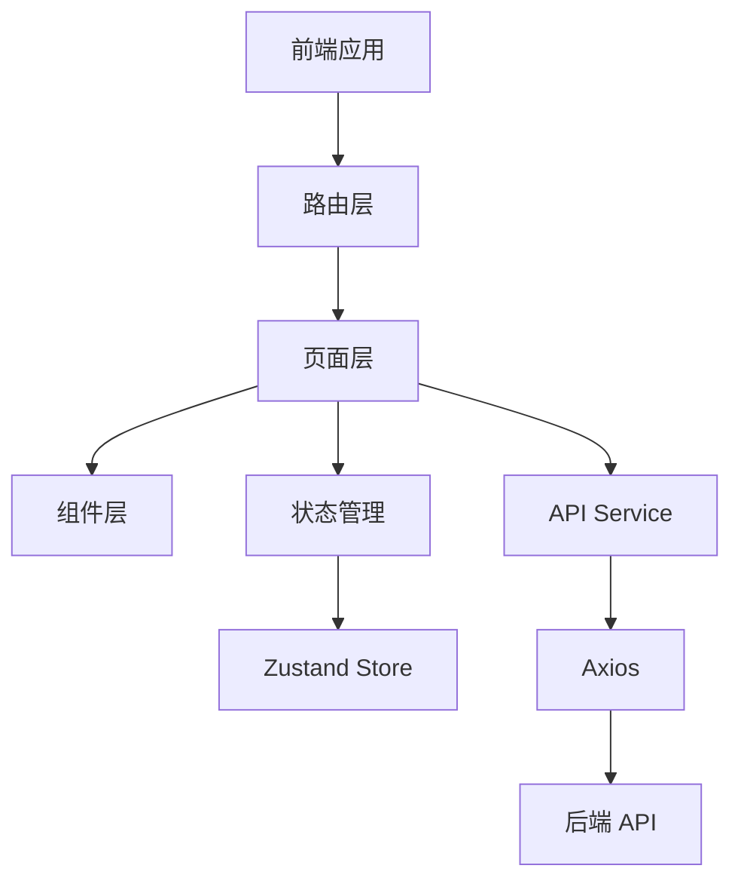
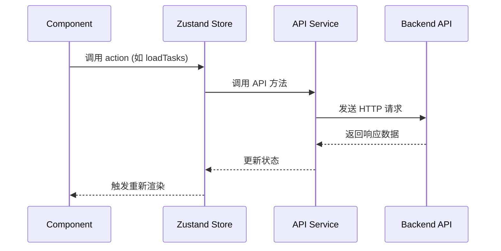

# 童劳童得 - 前端技术方案文档

## 1. 技术选型

| 分类 | 技术 | 版本 | 选型理由 |
|------|------|------|----------|
| **框架** | React | 18+ | 用户指定，生态成熟，社区活跃 |
| **UI框架** | TailwindCSS | 3+ | 原子化CSS，开发效率高，适合快速构建UI |
| **状态管理** | Zustand | 4+ | 轻量级状态管理，API简洁，适合中小项目 |
| **路由** | React Router | 6+ | React 官方路由库，功能完善 |
| **HTTP请求** | Axios | 1+ | 成熟稳定，支持拦截器、取消请求等功能 |
| **图标** | Lucide React | 0.290+ | 轻量级图标库，支持自定义样式 |
| **构建工具** | Vite | 5+ | 快速构建，热更新，现代化工具链 |
| **类型检查** | TypeScript | 5+ | 类型安全，提升开发体验 |

---

## 2. 架构设计

### 2.1 架构风格

采用 **组件化 + 状态管理** 的标准 React 架构，遵循以下原则：

| 原则 | 说明 |
|------|------|
| **组件单一职责** | 每个组件只负责一个功能或页面区域 |
| **状态分层** | 全局状态（用户、家庭）使用 Zustand，局部状态使用 React Hooks |
| **数据流向** | 单向数据流，从状态管理到组件 |
| **API 统一封装** | 所有 API 调用集中在 service 层 |

### 2.2 模块划分



---

## 3. 目录结构

```plaintext
frontend/                              # React 前端项目根目录
  ├── src/                             # 源代码目录
  │   ├── components/                  # 可复用组件
  │   │   ├── common/                  # 通用组件
  │   │   │   ├── Button.tsx           # 按钮组件
  │   │   │   ├── Input.tsx            # 输入框组件
  │   │   │   ├── Card.tsx             # 卡片组件
  │   │   │   ├── Avatar.tsx           # 头像组件
  │   │   │   ├── Badge.tsx            # 徽章组件
  │   │   │   └── Toast.tsx            # 提示组件
  │   │   ├── task/                    # 任务相关组件
  │   │   │   ├── TaskCard.tsx         # 任务卡片
  │   │   │   ├── TaskForm.tsx         # 任务表单
  │   │   │   └── TaskList.tsx         # 任务列表
  │   │   ├── score/                   # 积分相关组件
  │   │   │   ├── ScoreCard.tsx        # 积分卡片
  │   │   │   ├── ScoreChart.tsx       # 积分图表
  │   │   │   └── TransactionList.tsx  # 积分变动列表
  │   │   ├── redeem/                  # 兑换相关组件
  │   │   │   ├── RedeemItem.tsx       # 兑换商品卡片
  │   │   │   ├── RedeemModal.tsx      # 兑换弹窗
  │   │   │   └── RedeemList.tsx       # 兑换记录列表
  │   │   └── growth/                  # 成长记录组件
  │   │       ├── PhotoAlbum.tsx       # 照片相册
  │   │       └── Timeline.tsx         # 时间线组件
  │   ├── pages/                       # 页面组件
  │   │   ├── Home.tsx                 # 首页
  │   │   ├── Task.tsx                 # 任务页
  │   │   ├── Score.tsx                # 积分页
  │   │   ├── Redeem.tsx               # 兑换商城页
  │   │   ├── Growth.tsx               # 成长记录页
  │   │   ├── Family.tsx               # 家庭管理页
  │   │   └── Profile.tsx              # 个人中心页
  │   ├── stores/                      # Zustand 状态管理
  │   │   ├── authStore.ts             # 认证状态
  │   │   ├── familyStore.ts           # 家庭状态
  │   │   ├── taskStore.ts             # 任务状态
  │   │   ├── scoreStore.ts            # 积分状态
  │   │   └── redeemStore.ts           # 兑换状态
  │   ├── services/                    # API 服务层
  │   │   ├── auth.ts                  # 认证 API
  │   │   ├── family.ts                # 家庭 API
  │   │   ├── task.ts                  # 任务 API
  │   │   ├── score.ts                 # 积分 API
  │   │   ├── redeem.ts                # 兑换 API
  │   │   └── growth.ts                # 成长记录 API
  │   ├── hooks/                       # 自定义 Hooks
  │   │   ├── useAuth.ts               # 认证 Hook
  │   │   ├── useFamily.ts             # 家庭 Hook
  │   │   └── useToast.ts              # Toast Hook
  │   ├── types/                       # TypeScript 类型定义
  │   │   └── index.ts                 # 所有类型定义
  │   ├── utils/                       # 工具函数
  │   │   ├── axios.ts                 # Axios 配置
  │   │   └── format.ts                # 格式化工具
  │   ├── App.tsx                      # 根组件
  │   ├── main.tsx                     # 入口文件
  │   └── index.css                    # 全局样式
  ├── public/                          # 静态资源
  ├── index.html                       # HTML 模板
  ├── package.json                     # 依赖管理
  ├── tsconfig.json                    # TypeScript 配置
  ├── vite.config.ts                   # Vite 配置
  └── tailwind.config.js               # TailwindCSS 配置
```

---

## 4. 页面设计

### 4.1 页面路由

| 页面路径 | 页面组件 | 说明 | 是否需要登录 |
|----------|----------|------|--------------|
| `/` | `Home.tsx` | 首页/仪表盘 | 是 |
| `/task` | `Task.tsx` | 任务管理页 | 是 |
| `/score` | `Score.tsx` | 积分详情页 | 是 |
| `/redeem` | `Redeem.tsx` | 兑换商城页 | 是 |
| `/growth` | `Growth.tsx` | 成长记录页 | 是 |
| `/family` | `Family.tsx` | 家庭管理页 | 是 |
| `/profile` | `Profile.tsx` | 个人中心页 | 是 |
| `/login` | `Login.tsx` | 登录页 | 否 |

### 4.2 页面功能概述

#### 首页（Dashboard）

| 模块 | 功能 | 组件 |
|------|------|------|
| 顶部栏 | 用户信息、积分余额 | `Avatar`, `ScoreCard` |
| 快捷入口 | 任务、积分、兑换、成长 | 自定义图标按钮 |
| 今日任务 | 待完成任务列表 | `TaskList` |
| 积分趋势 | 本周积分变化图 | `ScoreChart` |

#### 任务管理页

| 模块 | 功能 | 组件 |
|------|------|------|
| 任务列表 | 按状态筛选（待领取/进行中/待验收/已完成） | `TaskList`, `TaskCard` |
| 任务操作 | 创建任务、完成任务、验收任务 | `TaskForm`, 操作按钮 |
| 任务详情 | 任务详情弹窗 | 自定义弹窗组件 |

#### 积分详情页

| 模块 | 功能 | 组件 |
|------|------|------|
| 积分概览 | 当前余额、今日变动 | `ScoreCard` |
| 积分趋势 | 图表展示 | `ScoreChart` |
| 变动记录 | 积分收入/支出列表 | `TransactionList` |

#### 兑换商城页

| 模块 | 功能 | 组件 |
|------|------|------|
| 商品分类 | 物质奖励/体验奖励/特权奖励 | Tab 切换 |
| 商品列表 | 展示可兑换商品 | `RedeemItem` |
| 兑换操作 | 发起兑换申请 | `RedeemModal` |
| 兑换记录 | 查看兑换历史 | `RedeemList` |

#### 成长记录页

| 模块 | 功能 | 组件 |
|------|------|------|
| 成长相册 | 成果照片墙 | `PhotoAlbum` |
| 时间线 | 成长节点记录 | `Timeline` |
| 成就徽章 | 获取的徽章展示 | `Badge` |

#### 家庭管理页

| 模块 | 功能 | 组件 |
|------|------|------|
| 家庭信息 | 家庭名称、头像、邀请码 | 信息卡片 |
| 成员列表 | 家庭成员展示 | `Avatar`, 成员卡片 |
| 成员操作 | 添加成员、移除成员 | 操作按钮 |

#### 个人中心页

| 模块 | 功能 | 组件 |
|------|------|------|
| 个人信息 | 昵称、头像、角色 | `Avatar`, 信息卡片 |
| 功能设置 | 修改信息、退出登录 | 设置项 |

---

## 5. 核心组件设计

### 5.1 通用组件

| 组件名 | 功能说明 | Props |
|--------|----------|-------|
| `Button` | 通用按钮 | `type: 'primary' \| 'secondary' \| 'danger'`, `size: 'sm' \| 'md' \| 'lg'`, `onClick`, `disabled` |
| `Input` | 通用输入框 | `label`, `placeholder`, `value`, `onChange`, `type`, `error` |
| `Card` | 卡片容器 | `title`, `children`, `className` |
| `Avatar` | 头像组件 | `src`, `size: 'sm' \| 'md' \| 'lg'`, `name` |
| `Badge` | 徽章组件 | `text`, `color: 'green' \| 'blue' \| 'orange' \| 'red'` |
| `Toast` | 提示组件 | `message`, `type: 'success' \| 'error' \| 'warning'`, `duration` |

### 5.2 业务组件

| 组件名 | 功能说明 | Props |
|--------|----------|-------|
| `TaskCard` | 任务卡片 | `task: Task`, `onComplete`, `onReview`, `role: 'parent' \| 'child'` |
| `TaskForm` | 任务表单 | `task?: Task`, `onSubmit`, `onCancel` |
| `ScoreCard` | 积分卡片 | `balance: number`, `todayChange?: number` |
| `ScoreChart` | 积分图表 | `data: ScoreData[]`, `period: 'week' \| 'month'` |
| `RedeemItem` | 兑换商品卡片 | `item: RedeemItem`, `onRedeem` |
| `PhotoAlbum` | 照片相册 | `photos: Photo[]` |
| `Timeline` | 时间线 | `items: TimelineItem[]` |

---

## 6. 状态管理设计

### 6.1 Store 结构

```typescript
// authStore.ts - 认证状态
interface AuthState {
    user: User | null;
    token: string | null;
    isLoggedIn: boolean;
    login: (code: string) => Promise<void>;
    logout: () => void;
}

// familyStore.ts - 家庭状态
interface FamilyState {
    family: Family | null;
    members: User[];
    currentChildId: number | null;
    setCurrentChild: (id: number) => void;
    loadFamily: () => Promise<void>;
    addMember: (inviteCode: string) => Promise<void>;
}

// taskStore.ts - 任务状态
interface TaskState {
    tasks: Task[];
    activeFilter: 'all' | 'pending' | 'in_progress' | 'review' | 'completed';
    setFilter: (filter: string) => void;
    loadTasks: () => Promise<void>;
    createTask: (task: TaskCreate) => Promise<void>;
    completeTask: (taskId: number, photo: File) => Promise<void>;
    reviewTask: (taskId: number, score: number, approved: boolean) => Promise<void>;
}

// scoreStore.ts - 积分状态
interface ScoreState {
    balance: number;
    transactions: Transaction[];
    loadBalance: () => Promise<void>;
    loadTransactions: () => Promise<void>;
}

// redeemStore.ts - 兑换状态
interface RedeemState {
    items: RedeemItem[];
    redeems: Redeem[];
    activeCategory: number;
    setCategory: (category: number) => void;
    loadItems: () => Promise<void>;
    loadRedeems: () => Promise<void>;
    createRedeem: (itemId: number) => Promise<void>;
    approveRedeem: (redeemId: number, approve: boolean) => Promise<void>;
}
```

### 6.2 状态交互流程



---

## 7. API 服务层设计

### 7.1 服务文件结构

| 文件 | 功能 | 方法 |
|------|------|------|
| `auth.ts` | 认证服务 | `login(code)` |
| `family.ts` | 家庭服务 | `getFamily(id)`, `createFamily(data)`, `addMember(data)`, `getMembers(familyId)` |
| `task.ts` | 任务服务 | `getTasks(params)`, `getTask(id)`, `createTask(data)`, `updateTask(id, data)`, `completeTask(id, data)`, `reviewTask(id, data)` |
| `score.ts` | 积分服务 | `getBalance()`, `getTransactions(params)`, `addPoints(data)`, `deductPoints(data)` |
| `redeem.ts` | 兑换服务 | `getItems(params)`, `createItem(data)`, `updateItem(id, data)`, `deleteItem(id)`, `createRedeem(data)`, `getRedeems(params)`, `approveRedeem(id, data)` |
| `growth.ts` | 成长记录服务 | `getPhotos(params)`, `getTimeline(params)`, `getReport(period)` |

### 7.2 Axios 配置

```typescript
// utils/axios.ts
import axios from 'axios';

const instance = axios.create({
    baseURL: import.meta.env.VITE_API_URL || 'http://localhost:8080/api',
    timeout: 10000,
});

// 请求拦截器 - 添加 Token
instance.interceptors.request.use(
    (config) => {
        const token = localStorage.getItem('token');
        if (token) {
            config.headers.Authorization = `Bearer ${token}`;
        }
        return config;
    },
    (error) => Promise.reject(error)
);

// 响应拦截器 - 处理错误
instance.interceptors.response.use(
    (response) => response.data,
    (error) => {
        if (error.response?.status === 401) {
            localStorage.removeItem('token');
            window.location.href = '/login';
        }
        return Promise.reject(error);
    }
);

export default instance;
```

---

## 8. 类型定义

### 8.1 核心类型

```typescript
// User 用户类型
interface User {
    id: number;
    open_id: string;
    nickname: string;
    avatar: string;
    role: 0 | 1; // 0-孩子，1-家长
    family_id: number;
    balance: number;
    created_at: string;
    updated_at: string;
}

// Family 家庭类型
interface Family {
    id: number;
    name: string;
    avatar: string;
    invite_code: string;
    created_at: string;
    updated_at: string;
}

// Task 任务类型
interface Task {
    id: number;
    title: string;
    description: string;
    points: number;
    status: 0 | 1 | 2 | 3 | 4; // 0-待领取，1-进行中，2-待验收，3-已完成，4-已拒绝
    assigned_to: number;
    created_by: number;
    photo: string;
    score: number;
    deadline: string;
    repeat_type: 0 | 1 | 2; // 0-单次，1-每日，2-每周
    created_at: string;
    updated_at: string;
}

// Transaction 积分记录类型
interface Transaction {
    id: number;
    user_id: number;
    type: 0 | 1; // 0-收入，1-支出
    amount: number;
    reason: string;
    related_id: number;
    related_type: string;
    created_at: string;
}

// RedeemItem 兑换商品类型
interface RedeemItem {
    id: number;
    family_id: number;
    name: string;
    description: string;
    points: number;
    image: string;
    category: 0 | 1 | 2; // 0-物质奖励，1-体验奖励，2-特权奖励
    stock: number;
    limit_per_person: number;
    created_at: string;
    updated_at: string;
}

// Redeem 兑换申请类型
interface Redeem {
    id: number;
    user_id: number;
    item_id: number;
    status: 0 | 1 | 2; // 0-待审核，1-已通过，2-已拒绝
    item?: RedeemItem;
    created_at: string;
    reviewed_at: string;
}

// Photo 照片类型
interface Photo {
    id: number;
    user_id: number;
    task_id: number;
    url: string;
    created_at: string;
}
```

---

## 9. 部署与集成方案

### 9.1 依赖配置

**package.json 关键依赖：**
```json
{
    "dependencies": {
        "react": "^18.2.0",
        "react-dom": "^18.2.0",
        "react-router-dom": "^6.22.0",
        "axios": "^1.6.0",
        "zustand": "^4.5.0",
        "lucide-react": "^0.290.0",
        "tailwindcss": "^3.4.0"
    },
    "devDependencies": {
        "@types/react": "^18.2.0",
        "@types/react-dom": "^18.2.0",
        "@vitejs/plugin-react": "^4.2.0",
        "typescript": "^5.3.0",
        "vite": "^5.0.0",
        "postcss": "^8.4.0",
        "autoprefixer": "^10.4.0"
    }
}
```

### 9.2 环境变量

**开发环境（.env.development）：**
```env
VITE_API_URL=http://localhost:8080/api
```

**生产环境（.env.production）：**
```env
VITE_API_URL=https://api.growpocket.com/api
```

### 9.3 启动方式

**开发模式：**
```bash
cd frontend
npm install
npm run dev
```

**构建生产版本：**
```bash
cd frontend
npm install
npm run build
```

**预览生产版本：**
```bash
npm run preview
```

---

## 10. 代码安全性

| 风险点 | 解决方案 |
|--------|----------|
| **XSS 攻击** | 使用 React 自动转义，禁止使用 dangerouslySetInnerHTML |
| **CSRF 攻击** | 使用 JWT Token 认证，后端验证 Origin |
| **敏感信息泄露** | Token 存储在 localStorage，设置 HttpOnly（如果使用 Cookie） |
| **API 越权** | 后端验证用户权限，前端根据角色控制显示 |
| **文件上传安全** | 限制文件类型（仅图片）和大小，后端校验 |
| **输入验证** | 前端表单验证 + 后端双重验证 |