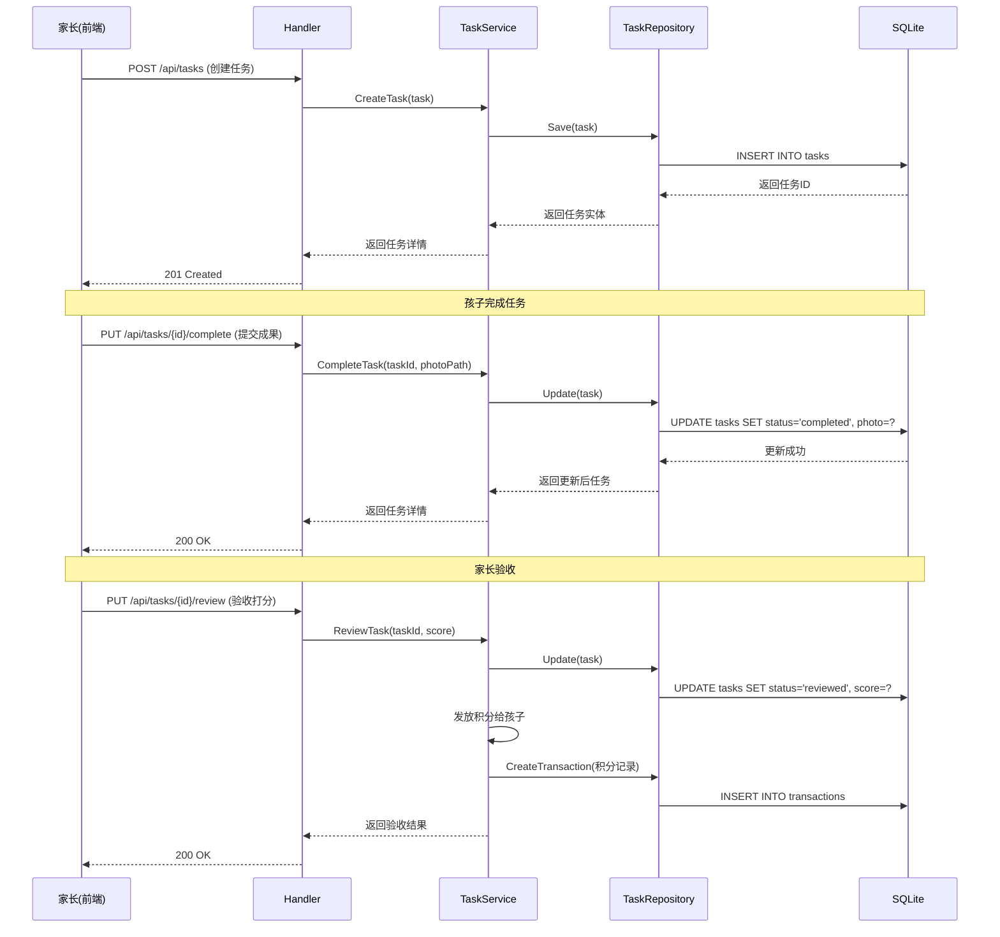
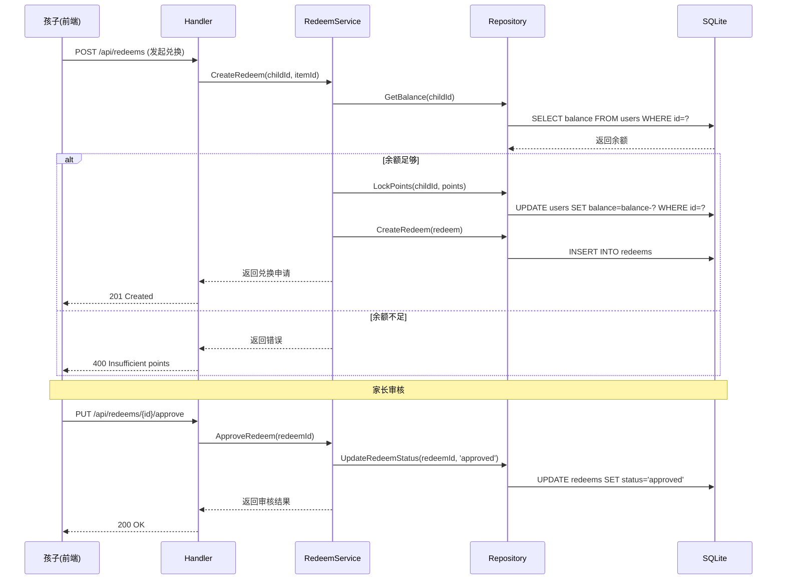

# 童劳童得 - 后端技术方案文档

## 1. 技术选型

| 分类 | 技术 | 版本 | 选型理由 |
|------|------|------|----------|
| **语言** | Go | 1.22+ | 高性能、高并发、语法简洁，适合构建微服务和 API 服务 |
| **框架** | Gin | 1.9+ | Go 生态最流行的 Web 框架，路由性能优异，中间件丰富 |
| **数据库** | SQLite | 3.45+ | 轻量级嵌入式数据库，无需独立部署，适合家庭类应用场景，开发调试方便 |
| **ORM** | GORM | 1.25+ | Go 最成熟的 ORM 库，支持 SQLite，提供便捷的 CRUD 操作 |
| **认证** | JWT | - | 无状态认证，适合前后端分离架构，便于扩展 |
| **图片存储** | LocalFS | - | MVP 阶段采用本地文件系统存储，后续可迁移至云存储 |
| **日志** | Zap | 1.27+ | Uber 出品的高性能日志库，结构化日志输出 |

---

## 2. 架构设计

### 2.1 架构风格

采用 **分层单体架构（Layered Monolith）**，将应用分为以下层次：

| 层级 | 职责 | 包名 |
|------|------|------|
| **路由层** | 处理 HTTP 请求，参数校验，调用 Service | `handler` |
| **业务层** | 实现核心业务逻辑，事务处理 | `service` |
| **数据访问层** | 数据库操作，实体映射 | `repository` |
| **模型层** | 数据库实体定义 | `model` |
| **工具层** | 通用工具函数 | `util` |

### 2.2 核心流程图

#### 任务闭环流程


#### 积分兑换流程


---

## 3. 目录结构

```plaintext
backend/                              # Go 后端项目根目录
  ├── cmd/                            # 命令入口
  │   └── main.go                     # 启动文件
  ├── internal/                       # 内部包（不对外暴露）
  │   ├── config/                     # 配置管理
  │   │   └── config.go               # 配置加载
  │   ├── handler/                    # HTTP 处理器
  │   │   ├── auth.go                 # 认证相关接口
  │   │   ├── family.go               # 家庭管理接口
  │   │   ├── task.go                 # 任务管理接口
  │   │   ├── score.go                # 积分管理接口
  │   │   ├── redeem.go               # 兑换管理接口
  │   │   └── growth.go               # 成长记录接口
  │   ├── service/                    # 业务逻辑层
  │   │   ├── auth.go                 # 认证服务
  │   │   ├── family.go               # 家庭服务
  │   │   ├── task.go                 # 任务服务
  │   │   ├── score.go                # 积分服务
  │   │   ├── redeem.go               # 兑换服务
  │   │   └── growth.go               # 成长记录服务
  │   ├── repository/                 # 数据访问层
  │   │   ├── family.go               # 家庭数据访问
  │   │   ├── task.go                 # 任务数据访问
  │   │   ├── score.go                # 积分数据访问
  │   │   ├── redeem.go               # 兑换数据访问
  │   │   └── growth.go               # 成长记录数据访问
  │   ├── model/                      # 数据模型
  │   │   ├── family.go               # 家庭实体
  │   │   ├── task.go                 # 任务实体
  │   │   ├── score.go                # 积分实体
  │   │   ├── redeem.go               # 兑换实体
  │   │   └── growth.go               # 成长记录实体
  │   ├── middleware/                 # 中间件
  │   │   ├── auth.go                 # JWT 认证中间件
  │   │   ├── logger.go               # 日志中间件
  │   │   └── cors.go                 # CORS 中间件
  │   └── util/                       # 工具函数
  │       ├── jwt.go                  # JWT 工具
  │       ├── logger.go               # 日志工具
  │       └── validator.go            # 参数校验工具
  ├── pkg/                            # 外部包（可对外暴露）
  │   └── response/                   # 统一响应封装
  │       └── response.go
  ├── uploads/                        # 图片上传目录
  ├── docs/                           # API 文档
  ├── go.mod                          # Go 依赖管理
  ├── go.sum
  └── .env                            # 环境变量配置
```

---

## 4. 关键类与方法设计

### 4.1 Handler 层

| Handler | 方法名 | 功能说明 | 参数 | 返回值 |
|---------|--------|----------|------|--------|
| `AuthHandler` | `Login` | 微信登录 | `code string` | `{token, user}` |
| `FamilyHandler` | `CreateFamily` | 创建家庭 | `name, avatar string` | `Family` |
| `FamilyHandler` | `AddMember` | 添加成员 | `familyId, role int` | `Member` |
| `TaskHandler` | `CreateTask` | 创建任务 | `task Task` | `Task` |
| `TaskHandler` | `CompleteTask` | 完成任务 | `taskId int, photo []byte` | `Task` |
| `TaskHandler` | `ReviewTask` | 验收任务 | `taskId int, score int` | `Task` |
| `ScoreHandler` | `GetBalance` | 获取余额 | `userId int` | `{balance}` |
| `ScoreHandler` | `AddPoints` | 手动加分 | `userId, points int, reason string` | `Transaction` |
| `RedeemHandler` | `CreateRedeem` | 发起兑换 | `itemId, userId int` | `Redeem` |
| `RedeemHandler` | `ApproveRedeem` | 审核兑换 | `redeemId int, approve bool` | `Redeem` |
| `GrowthHandler` | `GetAlbum` | 获取成长相册 | `userId int` | `[]Photo` |

### 4.2 Service 层

| Service | 方法名 | 功能说明 | 参数 | 返回值 |
|---------|--------|----------|------|--------|
| `AuthService` | `Login` | 微信登录并生成 Token | `code string` | `(user, token, error)` |
| `FamilyService` | `CreateFamily` | 创建家庭并添加创建者 | `name, avatar, creatorId string` | `(Family, error)` |
| `FamilyService` | `JoinFamily` | 通过邀请码加入家庭 | `inviteCode, userId string` | `(Family, error)` |
| `TaskService` | `CreateTask` | 创建任务并分配给成员 | `task Task, assignTo int` | `(Task, error)` |
| `TaskService` | `CompleteTask` | 完成任务并上传成果 | `taskId int, photoPath string` | `(Task, error)` |
| `TaskService` | `ReviewTask` | 验收任务并发放积分 | `taskId int, score int` | `(Task, error)` |
| `ScoreService` | `AwardPoints` | 发放积分 | `userId int, points int, reason string` | `(Transaction, error)` |
| `ScoreService` | `DeductPoints` | 扣除积分 | `userId int, points int, reason string` | `(Transaction, error)` |
| `RedeemService` | `CreateRedeem` | 创建兑换申请（冻结积分） | `userId, itemId int` | `(Redeem, error)` |
| `RedeemService` | `ApproveRedeem` | 审核兑换申请 | `redeemId int, approve bool` | `(Redeem, error)` |
| `GrowthService` | `GetGrowthTimeline` | 获取成长时间线 | `userId int` | `([]TimelineItem, error)` |

### 4.3 Repository 层

| Repository | 方法名 | 功能说明 | 参数 | 返回值 |
|------------|--------|----------|------|--------|
| `FamilyRepo` | `Create` | 创建家庭 | `family *Family` | `error` |
| `FamilyRepo` | `FindById` | 根据 ID 查询家庭 | `id int` | `(*Family, error)` |
| `FamilyRepo` | `FindByInviteCode` | 根据邀请码查询家庭 | `code string` | `(*Family, error)` |
| `TaskRepo` | `Create` | 创建任务 | `task *Task` | `error` |
| `TaskRepo` | `FindById` | 根据 ID 查询任务 | `id int` | `(*Task, error)` |
| `TaskRepo` | `FindByUserId` | 查询用户的任务列表 | `userId int` | `([]Task, error)` |
| `ScoreRepo` | `GetBalance` | 获取用户余额 | `userId int` | `(int, error)` |
| `ScoreRepo` | `AddBalance` | 增加余额 | `userId, amount int` | `error` |
| `ScoreRepo` | `SubBalance` | 减少余额 | `userId, amount int` | `error` |
| `ScoreRepo` | `CreateTransaction` | 创建积分记录 | `tx *Transaction` | `error` |
| `RedeemRepo` | `Create` | 创建兑换申请 | `redeem *Redeem` | `error` |
| `RedeemRepo` | `FindById` | 根据 ID 查询兑换 | `id int` | `(*Redeem, error)` |
| `GrowthRepo` | `CreatePhoto` | 创建成果照片 | `photo *Photo` | `error` |
| `GrowthRepo` | `FindPhotosByUserId` | 查询用户照片列表 | `userId int` | `([]Photo, error)` |

---

## 5. 数据库与数据结构设计

### 5.1 数据库表设计

#### families（家庭表）

| 字段名 | 类型 | 约束 | 说明 |
|--------|------|------|------|
| id | INTEGER | PRIMARY KEY AUTOINCREMENT | 家庭ID |
| name | VARCHAR(100) | NOT NULL | 家庭名称 |
| avatar | VARCHAR(255) | | 家庭头像URL |
| invite_code | VARCHAR(10) | UNIQUE NOT NULL | 邀请码 |
| created_at | DATETIME | DEFAULT CURRENT_TIMESTAMP | 创建时间 |
| updated_at | DATETIME | DEFAULT CURRENT_TIMESTAMP | 更新时间 |

#### users（用户表）

| 字段名 | 类型 | 约束 | 说明 |
|--------|------|------|------|
| id | INTEGER | PRIMARY KEY AUTOINCREMENT | 用户ID |
| open_id | VARCHAR(100) | UNIQUE NOT NULL | 微信OpenID |
| nickname | VARCHAR(50) | NOT NULL | 昵称 |
| avatar | VARCHAR(255) | | 头像URL |
| role | INTEGER | NOT NULL DEFAULT 0 | 角色：0-孩子，1-家长 |
| family_id | INTEGER | FOREIGN KEY | 所属家庭ID |
| balance | INTEGER | DEFAULT 0 | 积分余额 |
| created_at | DATETIME | DEFAULT CURRENT_TIMESTAMP | 创建时间 |
| updated_at | DATETIME | DEFAULT CURRENT_TIMESTAMP | 更新时间 |

#### tasks（任务表）

| 字段名 | 类型 | 约束 | 说明 |
|--------|------|------|------|
| id | INTEGER | PRIMARY KEY AUTOINCREMENT | 任务ID |
| title | VARCHAR(100) | NOT NULL | 任务标题 |
| description | TEXT | | 任务描述 |
| points | INTEGER | NOT NULL | 任务积分 |
| status | INTEGER | DEFAULT 0 | 状态：0-待领取，1-进行中，2-待验收，3-已完成，4-已拒绝 |
| assigned_to | INTEGER | FOREIGN KEY | 指派用户ID |
| created_by | INTEGER | FOREIGN KEY | 创建者ID |
| photo | VARCHAR(255) | | 成果照片URL |
| score | INTEGER | | 验收评分 |
| deadline | DATETIME | | 截止时间 |
| repeat_type | INTEGER | DEFAULT 0 | 重复类型：0-单次，1-每日，2-每周 |
| created_at | DATETIME | DEFAULT CURRENT_TIMESTAMP | 创建时间 |
| updated_at | DATETIME | DEFAULT CURRENT_TIMESTAMP | 更新时间 |

#### transactions（积分记录表）

| 字段名 | 类型 | 约束 | 说明 |
|--------|------|------|------|
| id | INTEGER | PRIMARY KEY AUTOINCREMENT | 记录ID |
| user_id | INTEGER | FOREIGN KEY NOT NULL | 用户ID |
| type | INTEGER | NOT NULL | 类型：0-收入，1-支出 |
| amount | INTEGER | NOT NULL | 金额 |
| reason | VARCHAR(200) | | 原因描述 |
| related_id | INTEGER | | 关联ID（任务/兑换ID） |
| related_type | VARCHAR(20) | | 关联类型（task/redeem） |
| created_at | DATETIME | DEFAULT CURRENT_TIMESTAMP | 创建时间 |

#### redeem_items（兑换商品表）

| 字段名 | 类型 | 约束 | 说明 |
|--------|------|------|------|
| id | INTEGER | PRIMARY KEY AUTOINCREMENT | 商品ID |
| family_id | INTEGER | FOREIGN KEY NOT NULL | 所属家庭ID |
| name | VARCHAR(100) | NOT NULL | 商品名称 |
| description | TEXT | | 商品描述 |
| points | INTEGER | NOT NULL | 所需积分 |
| image | VARCHAR(255) | | 商品图片URL |
| category | INTEGER | DEFAULT 0 | 分类：0-物质奖励，1-体验奖励，2-特权奖励 |
| stock | INTEGER | DEFAULT -1 | 库存（-1表示无限） |
| limit_per_person | INTEGER | DEFAULT 0 | 每人限兑次数（0表示不限） |
| created_at | DATETIME | DEFAULT CURRENT_TIMESTAMP | 创建时间 |
| updated_at | DATETIME | DEFAULT CURRENT_TIMESTAMP | 更新时间 |

#### redeems（兑换申请表）

| 字段名 | 类型 | 约束 | 说明 |
|--------|------|------|------|
| id | INTEGER | PRIMARY KEY AUTOINCREMENT | 兑换ID |
| user_id | INTEGER | FOREIGN KEY NOT NULL | 用户ID |
| item_id | INTEGER | FOREIGN KEY NOT NULL | 商品ID |
| status | INTEGER | DEFAULT 0 | 状态：0-待审核，1-已通过，2-已拒绝 |
| created_at | DATETIME | DEFAULT CURRENT_TIMESTAMP | 创建时间 |
| reviewed_at | DATETIME | | 审核时间 |

#### photos（成果照片表）

| 字段名 | 类型 | 约束 | 说明 |
|--------|------|------|------|
| id | INTEGER | PRIMARY KEY AUTOINCREMENT | 照片ID |
| user_id | INTEGER | FOREIGN KEY NOT NULL | 用户ID |
| task_id | INTEGER | FOREIGN KEY | 关联任务ID |
| url | VARCHAR(255) | NOT NULL | 照片URL |
| created_at | DATETIME | DEFAULT CURRENT_TIMESTAMP | 创建时间 |

### 5.2 实体模型结构

```go
// Family 家庭实体
type Family struct {
    ID         int       `gorm:"primaryKey;autoIncrement"`
    Name       string    `gorm:"size:100;not null"`
    Avatar     string    `gorm:"size:255"`
    InviteCode string    `gorm:"size:10;unique;not null"`
    CreatedAt  time.Time `gorm:"autoCreateTime"`
    UpdatedAt  time.Time `gorm:"autoUpdateTime"`
}

// User 用户实体
type User struct {
    ID       int       `gorm:"primaryKey;autoIncrement"`
    OpenID   string    `gorm:"size:100;unique;not null"`
    Nickname string    `gorm:"size:50;not null"`
    Avatar   string    `gorm:"size:255"`
    Role     int       `gorm:"not null;default:0"`
    FamilyID int       `gorm:"index"`
    Balance  int       `gorm:"default:0"`
    CreatedAt time.Time `gorm:"autoCreateTime"`
    UpdatedAt time.Time `gorm:"autoUpdateTime"`
}

// Task 任务实体
type Task struct {
    ID          int       `gorm:"primaryKey;autoIncrement"`
    Title       string    `gorm:"size:100;not null"`
    Description string    `gorm:"type:text"`
    Points      int       `gorm:"not null"`
    Status      int       `gorm:"default:0"`
    AssignedTo  int       `gorm:"index"`
    CreatedBy   int       `gorm:"index"`
    Photo       string    `gorm:"size:255"`
    Score       int       `gorm:"default:0"`
    Deadline    time.Time `gorm:"type:datetime"`
    RepeatType  int       `gorm:"default:0"`
    CreatedAt   time.Time `gorm:"autoCreateTime"`
    UpdatedAt   time.Time `gorm:"autoUpdateTime"`
}

// Transaction 积分记录实体
type Transaction struct {
    ID          int       `gorm:"primaryKey;autoIncrement"`
    UserID      int       `gorm:"index;not null"`
    Type        int       `gorm:"not null"`
    Amount      int       `gorm:"not null"`
    Reason      string    `gorm:"size:200"`
    RelatedID   int       `gorm:"index"`
    RelatedType string    `gorm:"size:20"`
    CreatedAt   time.Time `gorm:"autoCreateTime"`
}

// RedeemItem 兑换商品实体
type RedeemItem struct {
    ID             int       `gorm:"primaryKey;autoIncrement"`
    FamilyID       int       `gorm:"index;not null"`
    Name           string    `gorm:"size:100;not null"`
    Description    string    `gorm:"type:text"`
    Points         int       `gorm:"not null"`
    Image          string    `gorm:"size:255"`
    Category       int       `gorm:"default:0"`
    Stock          int       `gorm:"default:-1"`
    LimitPerPerson int       `gorm:"default:0"`
    CreatedAt      time.Time `gorm:"autoCreateTime"`
    UpdatedAt      time.Time `gorm:"autoUpdateTime"`
}

// Redeem 兑换申请实体
type Redeem struct {
    ID         int       `gorm:"primaryKey;autoIncrement"`
    UserID     int       `gorm:"index;not null"`
    ItemID     int       `gorm:"index;not null"`
    Status     int       `gorm:"default:0"`
    CreatedAt  time.Time `gorm:"autoCreateTime"`
    ReviewedAt time.Time `gorm:"type:datetime"`
}

// Photo 成果照片实体
type Photo struct {
    ID        int       `gorm:"primaryKey;autoIncrement"`
    UserID    int       `gorm:"index;not null"`
    TaskID    int       `gorm:"index"`
    URL       string    `gorm:"size:255;not null"`
    CreatedAt time.Time `gorm:"autoCreateTime"`
}
```

---

## 6. API 接口设计

### 6.1 认证接口

| 方法 | 路径 | 描述 |
|------|------|------|
| POST | `/api/auth/login` | 微信登录 |

**请求体：**
```json
{
    "code": "string"
}
```

**响应体：**
```json
{
    "code": 0,
    "message": "success",
    "data": {
        "token": "string",
        "user": {
            "id": 1,
            "nickname": "小明",
            "avatar": "string",
            "role": 0,
            "family_id": 1,
            "balance": 100
        }
    }
}
```

### 6.2 家庭管理接口

| 方法 | 路径 | 描述 |
|------|------|------|
| POST | `/api/families` | 创建家庭 |
| POST | `/api/families/{id}/members` | 添加家庭成员 |
| POST | `/api/families/join` | 通过邀请码加入家庭 |
| GET | `/api/families/{id}` | 获取家庭详情 |
| GET | `/api/families/{id}/members` | 获取家庭成员列表 |
| PUT | `/api/families/{id}` | 更新家庭信息 |
| DELETE | `/api/families/{id}/members/{memberId}` | 移除家庭成员 |

### 6.3 任务管理接口

| 方法 | 路径 | 描述 |
|------|------|------|
| POST | `/api/tasks` | 创建任务 |
| GET | `/api/tasks` | 获取任务列表 |
| GET | `/api/tasks/{id}` | 获取任务详情 |
| PUT | `/api/tasks/{id}/complete` | 完成任务（上传成果） |
| PUT | `/api/tasks/{id}/review` | 验收任务 |
| PUT | `/api/tasks/{id}` | 更新任务 |
| DELETE | `/api/tasks/{id}` | 删除任务 |

**创建任务请求体：**
```json
{
    "title": "string",
    "description": "string",
    "points": 10,
    "assigned_to": 1,
    "deadline": "2024-01-01 18:00:00",
    "repeat_type": 0
}
```

**完成任务请求体：**
```json
{
    "photo": "base64 string"
}
```

**验收任务请求体：**
```json
{
    "score": 10,
    "approved": true
}
```

### 6.4 积分管理接口

| 方法 | 路径 | 描述 |
|------|------|------|
| GET | `/api/score/balance` | 获取当前用户积分余额 |
| POST | `/api/score/add` | 手动添加积分 |
| POST | `/api/score/deduct` | 手动扣除积分 |
| GET | `/api/score/history` | 获取积分变动历史 |

**手动添加积分请求体：**
```json
{
    "user_id": 1,
    "points": 50,
    "reason": "考试进步奖励"
}
```

### 6.5 兑换商城接口

| 方法 | 路径 | 描述 |
|------|------|------|
| POST | `/api/redeem/items` | 创建兑换商品 |
| GET | `/api/redeem/items` | 获取兑换商品列表 |
| PUT | `/api/redeem/items/{id}` | 更新兑换商品 |
| DELETE | `/api/redeem/items/{id}` | 删除兑换商品 |
| POST | `/api/redeems` | 发起兑换申请 |
| GET | `/api/redeems` | 获取兑换记录 |
| PUT | `/api/redeems/{id}/approve` | 审核兑换申请 |

**创建兑换商品请求体：**
```json
{
    "name": "string",
    "description": "string",
    "points": 100,
    "image": "base64 string",
    "category": 0,
    "stock": 10,
    "limit_per_person": 1
}
```

**发起兑换请求体：**
```json
{
    "item_id": 1
}
```

### 6.6 成长记录接口

| 方法 | 路径 | 描述 |
|------|------|------|
| GET | `/api/growth/album` | 获取成长相册 |
| GET | `/api/growth/timeline` | 获取成长时间线 |
| GET | `/api/growth/report/{period}` | 获取成长报告（week/month） |

---

## 7. 主业务流程与调用链

### 7.1 任务验收发放积分流程

| 步骤 | 层级 | 方法 | 文件路径 |
|------|------|------|----------|
| 1 | Handler | `TaskHandler.ReviewTask` | `internal/handler/task.go` |
| 2 | Service | `TaskService.ReviewTask` | `internal/service/task.go` |
| 3 | Repository | `TaskRepo.FindById` | `internal/repository/task.go` |
| 4 | Repository | `TaskRepo.Update` | `internal/repository/task.go` |
| 5 | Service | `ScoreService.AwardPoints` | `internal/service/score.go` |
| 6 | Repository | `ScoreRepo.AddBalance` | `internal/repository/score.go` |
| 7 | Repository | `ScoreRepo.CreateTransaction` | `internal/repository/score.go` |

### 7.2 积分兑换流程

| 步骤 | 层级 | 方法 | 文件路径 |
|------|------|------|----------|
| 1 | Handler | `RedeemHandler.CreateRedeem` | `internal/handler/redeem.go` |
| 2 | Service | `RedeemService.CreateRedeem` | `internal/service/redeem.go` |
| 3 | Repository | `RedeemItemRepo.FindById` | `internal/repository/redeem.go` |
| 4 | Repository | `ScoreRepo.GetBalance` | `internal/repository/score.go` |
| 5 | Repository | `ScoreRepo.SubBalance` | `internal/repository/score.go` |
| 6 | Repository | `RedeemRepo.Create` | `internal/repository/redeem.go` |

---

## 8. 部署与集成方案

### 8.1 依赖与环境

**Go 依赖：**
```go
require (
    github.com/gin-gonic/gin v1.9.1
    gorm.io/gorm v1.25.4
    gorm.io/driver/sqlite v1.5.2
    github.com/golang-jwt/jwt/v5 v5.2.0
    github.com/spf13/viper v1.18.2
    go.uber.org/zap v1.27.0
    github.com/go-playground/validator/v10 v10.16.0
)
```

**环境变量配置（.env）：**
```env
SERVER_PORT=8080
DB_PATH=./data/example_db.db
JWT_SECRET=your_jwt_secret_key
UPLOAD_DIR=./uploads
```

### 8.2 启动方式

**开发模式：**
```bash
cd backend
go run cmd/main.go
```

**构建生产版本：**
```bash
cd backend
go build -o growpocket cmd/main.go
./growpocket
```

### 8.3 数据库初始化

应用启动时自动执行数据库迁移，创建所有表结构。

---

## 9. 代码安全性

| 风险点 | 解决方案 |
|--------|----------|
| SQL 注入 | 使用 GORM 的参数化查询，避免拼接 SQL |
| 越权访问 | 在 Service 层校验用户权限，确保只能访问自己家庭的数据 |
| JWT 泄露 | 设置合理的 Token 过期时间，支持 Token 黑名单机制 |
| 文件上传 | 限制文件类型和大小，对文件名进行安全处理，存储路径隔离 |
| 敏感数据 | 不存储明文密码（使用微信登录），日志中脱敏处理敏感字段 |
| 并发安全 | 使用数据库事务保证积分操作的原子性，避免超兑 |